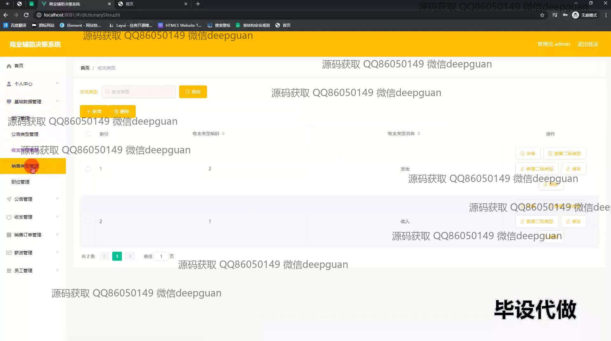
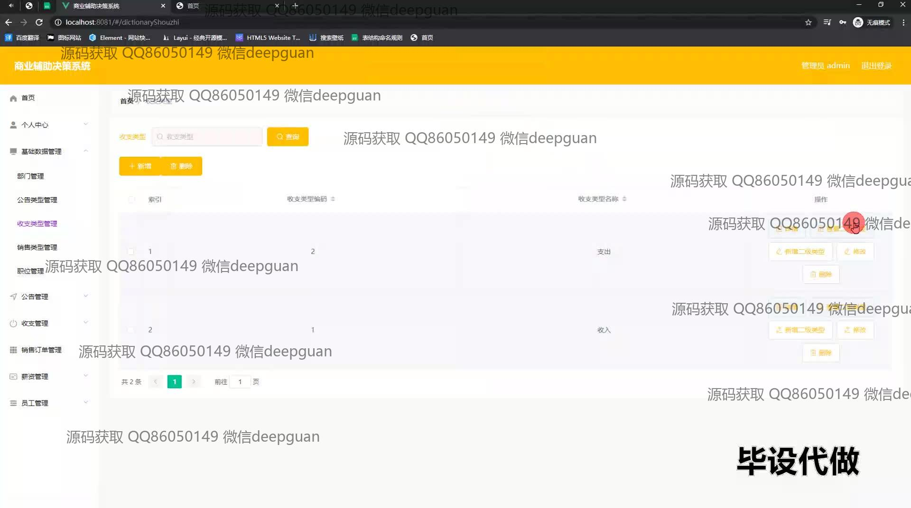
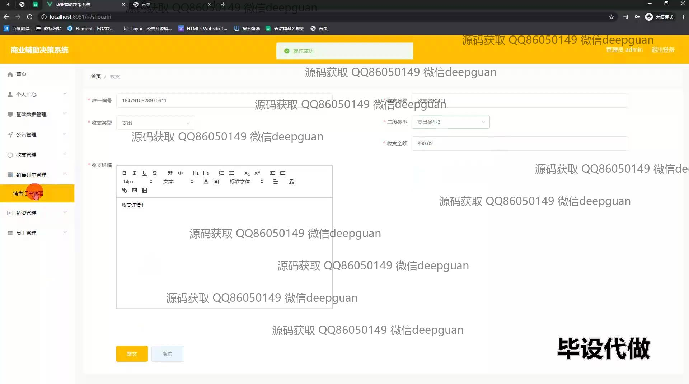
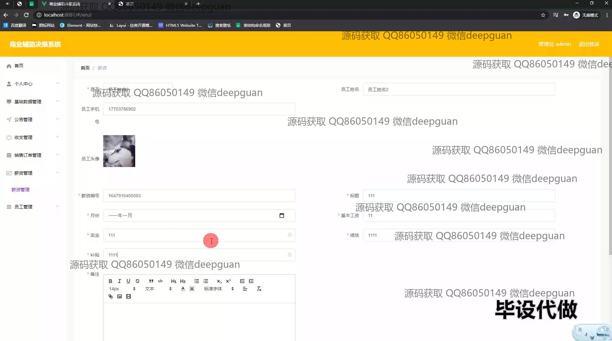
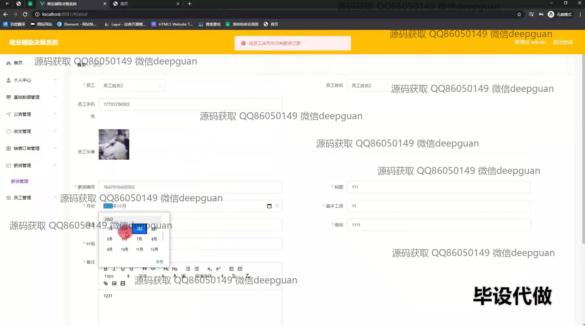
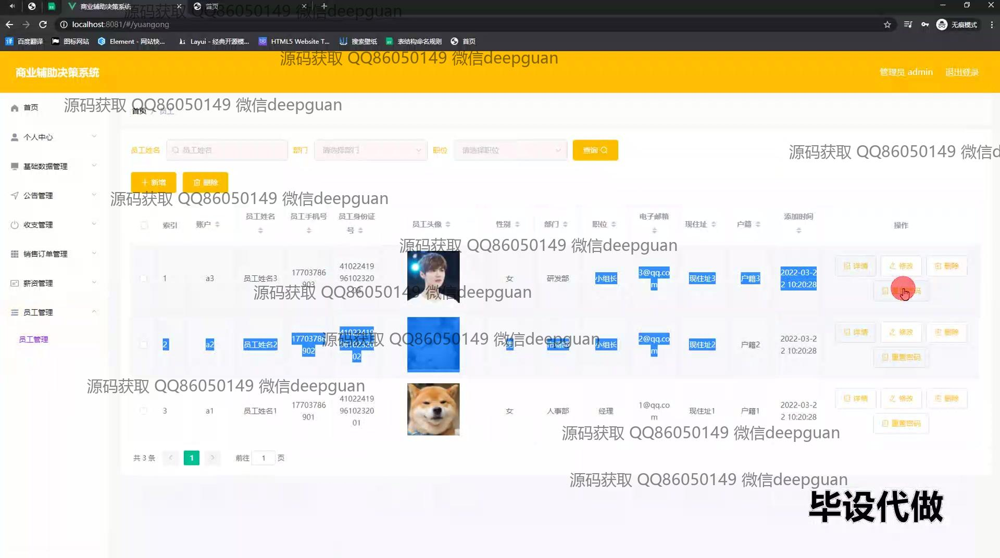
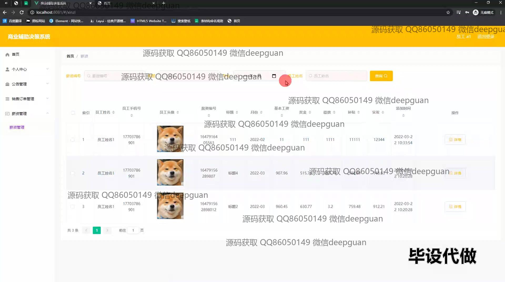
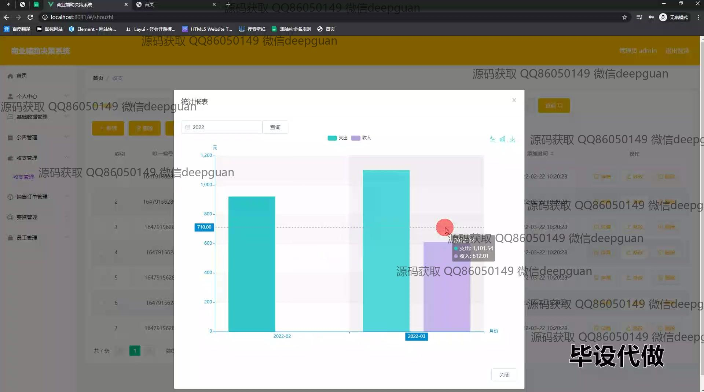

<h1 align="center">基于Mysql的商业辅助决策系统的设计与实现</h1>

## 简介
商业辅助决策系统，基于Spring Boot和MySQL，角色分为管理员与用户，提供数据可视化、报表生成、员工与薪资管理、销售订单与收支管理等功能，便于企业高效决策与财务数据管理。    --计算机毕业设计源码；毕设源码；java毕业设计源码

## 联系方式

<h3 align="center">获取完整代码与数据库文件 + 微信：deepguan QQ: 86050149 QQ群: 783742310</h3>

<h3 align="center">可帮忙远程部署 包运行成功！提供远程部署、修改代码、设计文档指导、代码讲解等服务！</h3>

## 功能介绍（完整见运行截图）
管理员：系统提供个人中心、基本数据管理、公告管理、部门管理和账单管理等模块，支持对商业决策系统的全面管理功能。管理员可以通过收支类型管理页面，添加、修改和删除财务数据类型，以及通过生成数据报表和可视化图表来进行深度分析，协助企业进行决策。强大的查询和筛选功能让管理员可以根据不同条件快速获取信息以便高效管理。

用户：用户界面提供了导航菜单支持，功能包括个人中心、信息管理、公告管理和销售订单管理等模块，方便用户进行不同类型的数据操作。在员工管理模块，用户可以查看和管理员工基本信息，利用搜索栏进行信息查询，并可进行新增、编辑和删除操作。在账单管理模块，用户能够计划和执行财务管理，有效进行收入与支出分析，借助图表与报表功能做出数据驱动的决策。

## 运行截图

本代码来源于网络,仅供学习参考使用!

